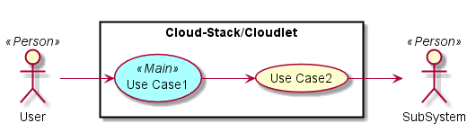
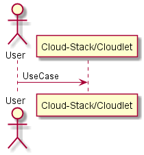
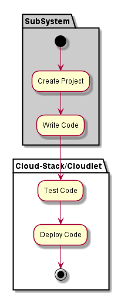
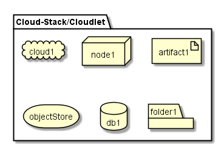
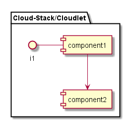

.. _SubSystem-Cloud-Stack/Cloudlet:

Cloud-Stack/Cloudlet
============

Cloud-Stack/Cloudlet is a subsystem of Heterogenous_Hyper_Cloud ...

Use Cases
---------

*

Users
-----

* :ref:`Actor-User`

Uses
----

* :ref:`Cloud-Stack/Cloudlet`

Interface
---------

* CLI - Command Line Interface
* REST-API -
* Portal - Web Portal

Logical Artifacts
-----------------

*

.. image:: Logical.png

Activities and Flows
--------------------

Deployment Architecture
-----------------------

Physical Architecture
---------------------

