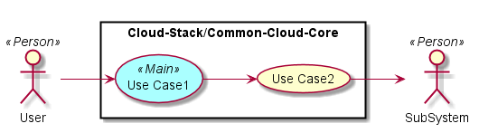
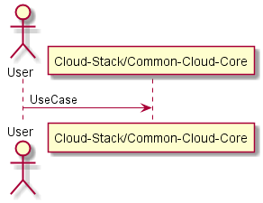
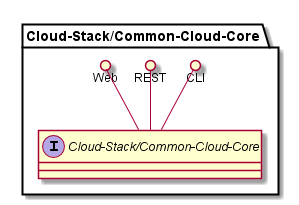
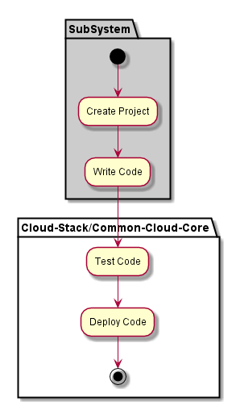
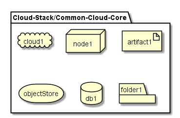
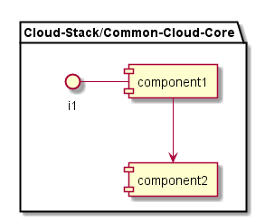

.. _SubSystem-Cloud-Stack/Common-Cloud-Core:

Cloud-Stack/Common-Cloud-Core
============

Cloud-Stack/Common-Cloud-Core is a subsystem of Heterogenous_Hyper_Cloud ...

Use Cases
---------

*

Users
-----

* :ref:`Actor-User`

Uses
----

* :ref:`Cloud-Stack/Common-Cloud-Core`

Interface
---------

* CLI - Command Line Interface
* REST-API -
* Portal - Web Portal

Logical Artifacts
-----------------

*

Activities and Flows
--------------------

Deployment Architecture
-----------------------

Physical Architecture
---------------------

