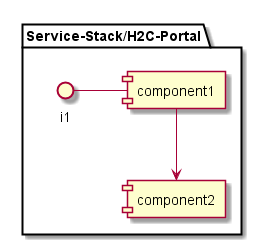

.. _SubSystem-H2C-Portal:

H2C Portal
==========

H2C-Portal is a subsystem of Heterogeneous Hyper Cloud. It is the main portal that Work is submitted to the Cloud.
It is the job of the H2C-Portal to evaluate the Work Request and determine the types of resources that will required
to handle the work. It could be a simple Cloud workload, HPC workload or a Hyrbid Workload.

Use Cases
---------
* :ref:`Scenario-Submit-Hybrid-Workload`
* :ref:`Scenario-Submit-Cloud-Workload`
* :ref:`Scenario-Submit-HPC-Workload`
* :ref:`UseCase-Submit-Workload`
* :ref:`UseCase-Manage-Workload`

Users
-----

* :ref:`Actor-User`

.. image:: UserInteraction.png

Uses
----

* :ref:`Service-Stack/H2C-Portal`

Interface
---------

* CLI - Command Line Interface
* REST-API -
* Portal - Web Portal

Logical Artifacts
-----------------

*

Activities and Flows
--------------------

Deployment Architecture
-----------------------

Physical Architecture
---------------------

